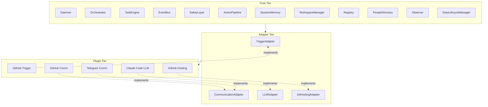
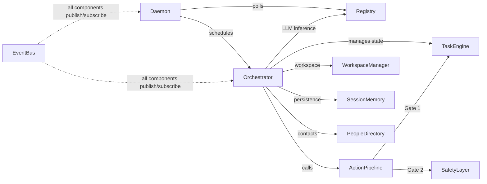
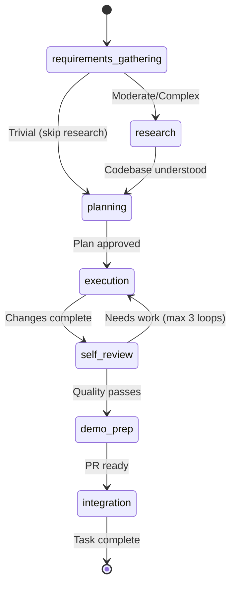
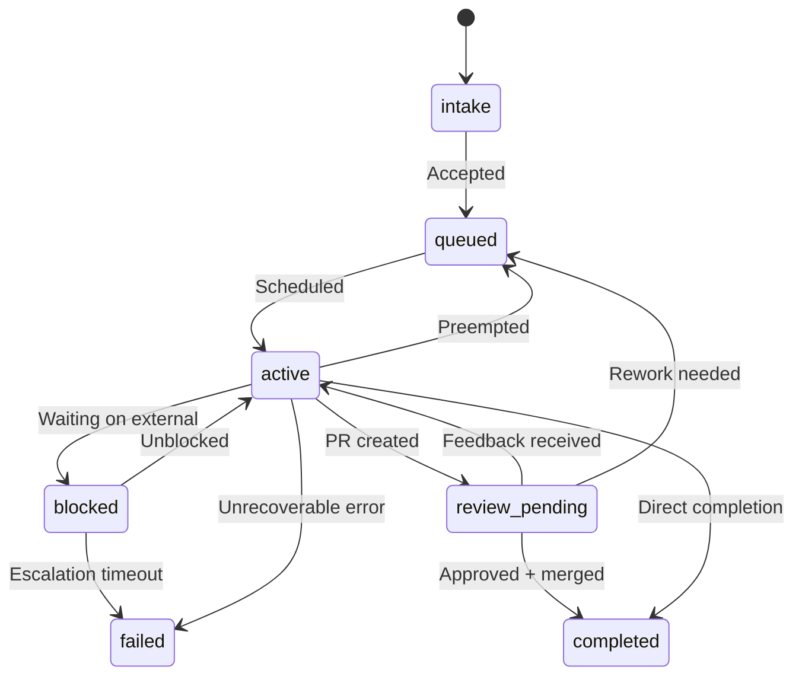

# Architecture

## Overview

The Engineer is an autonomous software engineering agent. It receives tasks (typically via GitHub issues), researches the codebase, plans a solution, executes changes, self-reviews its work, and ships pull requests. It runs as a background daemon that polls for new work, schedules tasks by priority, and dispatches them through a seven-phase pipeline.

The system is designed around three principles: **modularity** (every external integration is a swappable plugin), **safety** (two authorization gates before any side effect), and **auditability** (every action is an event persisted to the database).

## Three-Tier Architecture

The codebase is organized into three tiers with strict import boundaries:

- **Core** — Invariant components that define system behavior. Never depends on specific plugins or external services.
- **Adapters** — Abstract base classes that define integration contracts. The SDK boundary for plugin authors.
- **Plugins** — Concrete implementations of adapter contracts. Swappable, independently testable.



**Import rules:** Core never imports from Plugins. Plugins import only from the Adapter SDK boundary (`src/adapters/index.ts`). Adapters never import from Core.

## Core Components



| Component | Responsibility |
|-----------|---------------|
| **Daemon** | Tick loop: poll triggers, schedule tasks, dispatch to Orchestrator, monitor health |
| **Orchestrator** | Seven-phase task execution pipeline, agent loop, workspace lifecycle |
| **TaskEngine** | Task state machine, transitions, permissions, priority queries |
| **EventBus** | Pub/sub with SQLite persistence, replay for state reconstruction, glob pattern subscriptions |
| **SafetyLayer** | Policy evaluation, cost tracking, autonomy verdicts |
| **ActionPipeline** | Authorization middleware: Gate 1 (state check) + Gate 2 (policy check) + Execute + Notify |
| **SessionMemory** | Session lifecycle, journal entries, checkpoints, knowledge store |
| **WorkspaceManager** | Git worktree creation/cleanup per task |
| **Registry** | Plugin discovery, five-phase loading, health monitoring, lifecycle management |
| **PeopleDirectory** | Config-driven contact resolution for notifications and escalations |
| **Observer** | Structured tracing facade — spans, observations, blob storage for the dashboard |
| **DataLifecycleManager** | Retention cleanup, blob orphan pruning, incremental vacuum |

## Task Lifecycle

Each task flows through a seven-phase pipeline inside the Orchestrator. Trivial tasks (assessed during requirements gathering) skip the research phase — planning always runs.



**Phases:**

1. **Intake Analysis** — Parse requirements, identify gaps, determine complexity
2. **Research** — Explore codebase, read documentation, understand context
3. **Planning** — Design solution, create implementation plan
4. **Execution** — Write code, run tests, iterate on failures
5. **Self-Review** — Review own changes as a code reviewer (loops back to execution if issues found)
6. **Demo Prep** — Create draft PR, write description, prepare for review
7. **Integration** — Finalize PR, notify stakeholders, clean up

## Task State Machine

Tasks follow a CPU-derived state machine:



**States** (7 base states, 5 sub-states):

| State | Sub-states | Description |
|-------|------------|-------------|
| `intake` | — | Task received, being analyzed |
| `queued` | — | Ready for execution, waiting to be scheduled |
| `active` | `working`, `supervising`, `integrating` | Currently being worked on by the Orchestrator |
| `blocked` | — | Waiting on external input (human response, review feedback) |
| `review_pending` | `demo`, `code` | PR created, awaiting review (draft → ready) |
| `completed` | — | Successfully completed, PR merged |
| `failed` | — | Failed after exhausting recovery options |

## Plugin System

Plugins implement adapter contracts and are discovered via manifest files.

**Manifest** (`engineer.plugin.yaml`):

```yaml
id: my-trigger
type: trigger
version: "1.0.0"
name: My Custom Trigger
description: Polls a custom source for new tasks
critical: true
requirements:
  - type: binary
    name: my-trigger-cli
entry: index.ts
adapter_meta:
  poll_interval: "60s"
contributes:
  events:
    - trigger.new_event
```

**Five-phase loading:**

1. **Discover** — Scan configured directories for `engineer.plugin.yaml` manifests
2. **Validate** — Check unique IDs, type validity, entry point existence
3. **Order** — Sort by adapter type (Communication > LLM > GitHosting > Trigger)
4. **Load** — Dynamic import, call `createPlugin()` factory function
5. **Initialize** — Validate config, resolve env vars, call `plugin.initialize(config)`

**Health state machine:** `healthy` > `unhealthy` (1 failed check) > `failed` (3 consecutive failures). Health checks run every 60 seconds.

## Event Bus

The EventBus is the nervous system of the application. Every significant action produces an event that is persisted to SQLite.

- **Pub/sub** with synchronous delivery within the process
- **Glob pattern subscriptions** — subscribe to `task.*`, `cost.*`, `*`, etc.
- **Persistence** — every event stored with ULID + auto-increment sequence number
- **Replay** — reconstruct state from event history (used for crash recovery)
- **Audit trail** — the event stream IS the system's audit log

## Safety Model

Every side-effecting action passes through two authorization gates:

1. **Gate 1 (TaskEngine)** — Is this action permitted given the task's current state and phase?
2. **Gate 2 (SafetyLayer)** — Does this action comply with configured policies, cost limits, and autonomy level?

The SafetyLayer tracks cost across configurable time windows and can escalate to human approval when thresholds are exceeded. Three autonomy levels control how much the agent can do without human intervention.

## Further Reading

- [Plugin Documentation](../plugins/) — Adapter contracts, per-plugin references, development guides
- [Philosophy](../philosophy.md) — Core beliefs driving every decision
- [Build Journal — Archive](../archived/) — Phase-by-phase development history (not authoritative; read code and `docs/` for ground truth)
