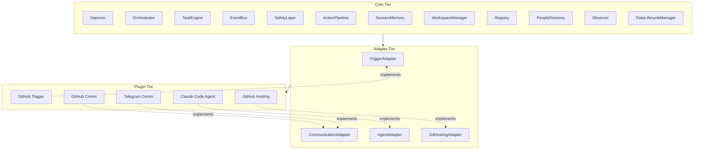
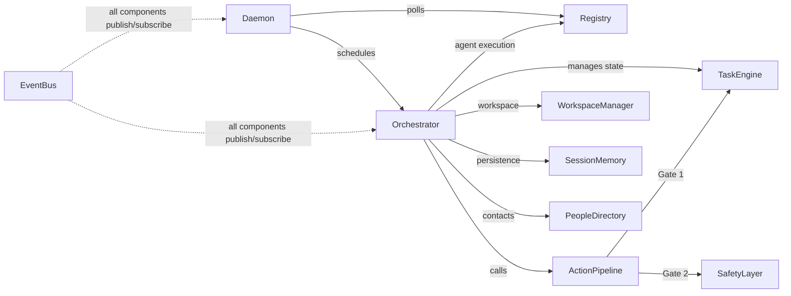
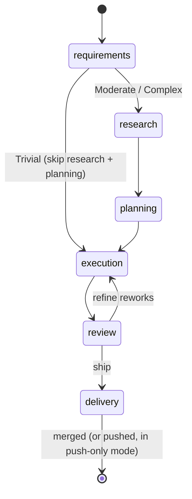
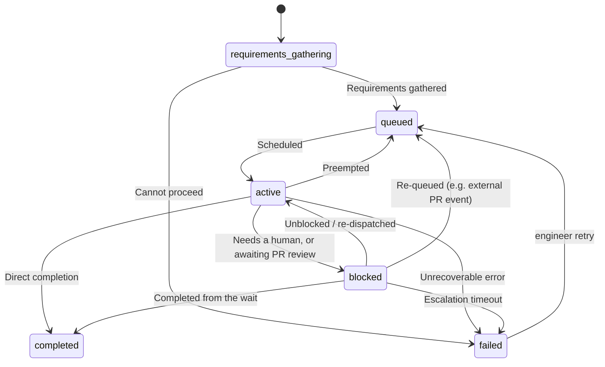

# Architecture

## Overview

The Engineer is an autonomous software engineering agent. It receives tasks (typically via GitHub issues), researches the codebase, plans a solution, executes changes, reviews its own work, and ships pull requests. It runs as a background daemon that polls for new work, schedules tasks by priority, and dispatches them through a six-phase pipeline.

The system is designed around three principles: **modularity** (every external integration is a swappable plugin), **safety** (two authorization gates before any side effect), and **auditability** (every action is an event persisted to the database).

## Three-Tier Architecture

The codebase is organized into three tiers with strict import boundaries:

- **Core** — Invariant components that define system behavior. Never depends on specific plugins or external services.
- **Adapters** — Abstract base classes that define integration contracts. The SDK boundary for plugin authors.
- **Plugins** — Concrete implementations of adapter contracts. Swappable, independently testable.



**Import rules:** Core never imports from Plugins. Plugins import only from the Adapter SDK boundary (`src/adapters/index.ts`). Adapters never import from Core.

## Core Components



| Component | Responsibility |
|-----------|---------------|
| **Daemon** | Tick loop: poll triggers, schedule tasks, dispatch to Orchestrator, monitor health |
| **Orchestrator** | Six-phase task execution pipeline, agent loop, workspace lifecycle |
| **TaskEngine** | Task state machine, transitions, permissions, priority queries |
| **RetryPolicy** | Single source of truth for task-level retry semantics — per-category backoff schedules, ceilings, and terminal disposition. Called by the scheduler (crash + agent-unavailable) and by boot recovery |
| **DispatchTracker** | Single owner of in-flight dispatch lifecycle. Mints a per-dispatch identity so late callbacks are idempotent across re-dispatch, owns the `AbortSignal` exposed to the orchestrator, and exposes one `terminate(taskId, reason)` path that routes preemption, cost-limit, hard-cap, and graceful-shutdown through `Outcomes.terminated`. Drains on shutdown with a single shared timeout. See [scheduling-dispatch.md](scheduling-dispatch.md). |
| **EventBus** | Pub/sub with SQLite persistence, replay for state reconstruction, glob pattern subscriptions |
| **SafetyLayer** | Policy evaluation, cost tracking, autonomy verdicts |
| **ActionPipeline** | Authorization middleware: Gate 1 (state check) + Gate 2 (policy check) + Execute + Notify |
| **SessionMemory** | Session lifecycle, journal entries, checkpoints |
| **WorkspaceManager** | Git worktree creation/cleanup per task |
| **Registry** | Plugin discovery, five-phase loading, health monitoring, lifecycle management |
| **PeopleDirectory** | Config-driven contact resolution for notifications and escalations |
| **Observer** | Structured tracing facade — spans, observations, blob storage for the dashboard |
| **DataLifecycleManager** | Retention cleanup, blob orphan pruning, incremental vacuum |

## Task Lifecycle

Each task flows through a six-phase pipeline inside the Orchestrator. Trivial tasks (assessed during requirements) skip both research and planning.



**Phases:**

1. **Requirements** — Understand the task, ground in the codebase, assess complexity, and ask the owner only if a decision genuinely needs a person.
2. **Research** — Study the code the change touches (skipped for trivial tasks).
3. **Planning** — Design the approach and stress-test it (skipped for trivial tasks).
4. **Execution** — Write the code, then prove it by running the project's own gates.
5. **Review** — Lenses find issues; `refine` fixes them in place and decides whether to ship.
6. **Delivery** — Write the PR description, push, open the pull request, and merge on approval — or, in push-only mode, just push.

See [the pipeline architecture](pipeline.md) for the full model: sub-phases, routing, loop caps, and external re-entry.

## Task State Machine

Tasks follow a CPU-derived state machine. The authoritative definitions live in `src/schemas/task.ts` (`TaskStateSchema`, `SubStateSchema`, `ValidTransitions`).



**States:**

| State | Sub-states | Description |
|-------|------------|-------------|
| `requirements_gathering` | — | Initial state. Clarifying intent before scheduling. |
| `queued` | — | Ready for execution, waiting to be scheduled |
| `active` | `working` | Currently being worked on by the Orchestrator |
| `blocked` | — | Waiting — either on a human (a question or decision) or on an external PR event (review, CI, approval, merge). The block reason distinguishes them. |
| `completed` | — | Successfully completed (PR merged, or branch pushed in push-only mode) |
| `failed` | — | Failed after exhausting recovery options |

## Plugin System

Each plugin implements one adapter contract. Plugins are registered in `src/plugins/builtin.ts` — a manifest object plus a factory function per plugin — and validated against `PluginManifestSchema` at import time.

**Manifest** (a TypeScript object in `builtin.ts`):

```ts
{
  id: "github-trigger",
  type: "trigger",                       // adapter type: trigger | communication | agent | git_hosting
  version: "1.0.0",
  name: "GitHub Trigger",
  description: "Polls GitHub for assigned issues",
  critical: true,                        // abort startup on failure (vs. degrade)
  requirements: [{ type: "env", name: "GITHUB_TOKEN" }],
  combined_with: ["github-comm", "github-hosting"],
  entry: "builtin",
  poll_interval_ms: 30_000,              // daemon's per-plugin poll cadence (falls back to global config)
  adapter_meta: {},                      // e.g. capabilities / channel for comm plugins
  contributes: { events: ["trigger.new_event"] },
}
```

**Loading:**

1. **Select** — `discoverEnabledPlugins` reads the plugin-config directory and keeps the built-in plugins whose `id` matches an enabled config file.
2. **Register** — each enabled plugin is registered with the Registry (manifest + factory).
3. **Initialize** — config is validated, env vars are resolved, and `initialize()` is called; health monitoring starts.

**Health state machine:** `healthy` > `unhealthy` (1 failed check) > `failed` (3 consecutive failures). Health checks run on the configured interval.

To add a plugin, see the per-adapter guides under [docs/plugins/](../plugins/) — each ends with a "Registration in builtin.ts" section.

## Event Bus

The EventBus is the nervous system of the application. Every significant action produces an event that is persisted to SQLite.

- **Pub/sub** with synchronous delivery within the process
- **Glob pattern subscriptions** — subscribe to `task.*`, `cost.*`, `*`, etc.
- **Persistence** — every event stored with ULID + auto-increment sequence number
- **Replay** — reconstruct state from event history (used for crash recovery)
- **Audit trail** — the event stream IS the system's audit log

## Safety Model

Every side-effecting action passes through two authorization gates:

1. **Gate 1 (TaskEngine)** — Is this action permitted given the task's current state and phase?
2. **Gate 2 (SafetyLayer)** — Does this action comply with configured policies, cost limits, and autonomy level?

The SafetyLayer tracks cost across configurable time windows and can escalate to human approval when thresholds are exceeded. Three autonomy levels control how much the agent can do without human intervention.

## Further Reading

- [The Pipeline](pipeline.md) — How a task flows through the six phases: sub-phases, routing, loop caps, and external re-entry
- [Plugin Documentation](../plugins/) — Adapter contracts, per-plugin references, development guides
- [Philosophy](../philosophy.md) — Core beliefs driving every decision
- [Build Journal — Archive](../archived/) — Phase-by-phase development history (not authoritative; read code and `docs/` for ground truth)
