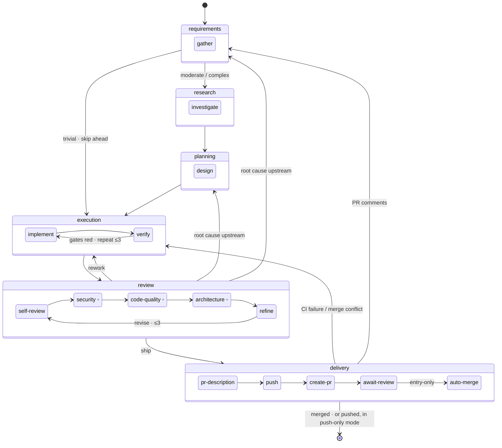

# The Pipeline

The per-task pipeline is the heart of The Engineer: the path every task walks from intake to merged pull request. This document explains its shape and the reasoning behind it. If you read one architecture doc to understand how the system actually does engineering work, read this one.

> **Key terms:** a **phase** is a stage of work (requirements, research, …); a **sub-phase** is one step within a phase; the **runner** is the generic loop that drives a task through them. See also the [architecture overview](overview.md) and the [three-tier model](three-tier-model.md).

## The intuition principle

A task walks through six **phases**. Each phase is a **folder**. Each step within a phase is a **sub-phase**, and each sub-phase is a **file**. Every sub-phase file owns exactly two things: **how to do its work** (`run`) and **where to go next** (`next`). That is the whole architecture. The folder tree *is* the pipeline — read the tree and you know the system; open a file and you understand one step completely.

```
src/core/orchestrator/pipeline/
  runner.ts          ← the generic loop. Drives whatever the map declares; rarely touched.
  types.ts           ← SubPhase, SubPhaseResult, Route, Ctx — the vocabulary.
  pipeline.ts        ← the phase order and each phase's sub-phase list — the map.
  agent-step.ts      ← the one defended boundary around the opaque agent subprocess.
  pr-events.ts       ← Core policy for external PR events (routing, arbitration, dedup, /approve).

  requirements/  gather.ts
  research/      investigate.ts
  planning/      design.ts
  execution/     implement.ts · verify.ts
  review/        self-review.ts · security.ts · code-quality.ts · architecture.ts · refine.ts   (lens.ts = the shared lens factory, not a sub-phase)
  delivery/      pr-description.ts · push.ts · create-pr.ts · await-review.ts · auto-merge.ts   (deliverable.ts = the push-only skip-gate helper, not a sub-phase)
```

## The six phases

The full map — every sub-phase, every loop, every hand-back. Solid sequence inside a phase; labeled edges are the routes `next` can take (◦ marks the opt-in lenses, which skip unless enabled in `review.lenses`):



| Phase            | Default sub-phases                                                                   | What makes it right                                                                                                                                                                                                               |
| ---------------- | ------------------------------------------------------------------------------------ | --------------------------------------------------------------------------------------------------------------------------------------------------------------------------------------------------------------------------------- |
| **Requirements** | `gather`                                                                             | Grounds in the codebase, writes a Context Summary *first* (a wrong understanding is caught at the first artifact), assesses complexity, and batches every question for a person into one outreach. `needs_human` blocks the task. |
| **Research**     | `investigate`                                                                        | Observations separated from inferences. Skips entirely on a trivial task.                                                                                                                                                         |
| **Planning**     | `design`                                                                             | One agent session that designs *and* stress-tests its own plan, recording decisions with their rejected alternatives. Skips on a trivial task.                                                                                    |
| **Execution**    | `implement` → `verify`                                                               | `implement` writes the code and commits as it goes; `verify` proves it by running the project's own gates as real subprocesses. The agent cannot fake `verify`.                                                                   |
| **Review**       | `self-review` (+ opt-in lenses) → `refine`                                           | Lenses *find*; `refine` *fixes in place* and decides ship / re-check / hand back. See [post-execution review](../user-flows/post-execution-review/overview.md).                                                                   |
| **Delivery**     | `pr-description` → `push` → `create-pr` → `await-review` (+ entry-only `auto-merge`) | Produces the deliverable: a merged PR, or a pushed branch. See [PR management](../user-flows/pr-management/overview.md).                                                                                                          |

A single sub-phase per phase is the common case, and that is fine — the architecture makes *growing* a phase cheap without forcing it. Review and Delivery genuinely need several sub-phases today; the others do not.

## A sub-phase

Every sub-phase is the same small shape:

```typescript
interface SubPhase {
  name: string;
  skip?: (ctx) => SkipReason | null;   // optional: don't even run this step
  run:   (ctx) => Promise<SubPhaseResult>;  // do the work
  next:  (result, ctx) => Route;       // read the result, return where to go — pure, no effects
}
```

To know what a step does, read its `run` and its `next`. Both are ordinary functions that appear in stack traces by name. There is no routing DSL, no rule arrays, no first-match-wins order to memorize.

## The handoff: the agent reports an outcome; the orchestrator owns the route

A sub-phase's real work often runs in a **separate autonomous coding-agent subprocess** (Claude Code, OpenCode, Gemini CLI). That subprocess reports back through a small, honest vocabulary in `session-result.json`:

```json
{ "status": "ok" | "needs_human" | "failed", "summary": "one line", "details": { } }
```

**The agent never names a phase.** It reports *what happened* — I did the job, I need a person, or I failed. The sub-phase's `next` function (orchestrator code we own, grep, and test) maps that outcome to a destination. This kills a whole bug class: the agent literally cannot route to a wrong or dead phase, because it does not choose phases.

**We do not trust the self-report.** A subprocess can write `"ok"` without earning it, so the architecture re-checks downstream: `implement`'s claim is proven by `verify` (real gates the agent cannot fake), and the whole change is checked again by `review`. Routing correctness is not bounded by an agent's honesty.

Only `refine` needs more than three outcomes (ship vs. re-check vs. hand-back), so it puts a typed `verdict` in `details`, validated against its own schema. The common contract stays dead simple; the richness is local and type-checked.

## The defended boundary: `agent-step`

The opaque subprocess is where the genuine risk lives — it can die mid-write, leave a stale template, or self-report success it didn't earn. `agent-step.ts` concentrates *all* of that risk in one well-tested helper. An agent sub-phase is built as `run: agentStep({ prompt, systemPrompt, detailsSchema })`, and `agentStep` owns:

- Spawning the agent through the `AgentAdapter`, **handing over the abort signal** so termination (preemption, shutdown, cost-limit) actually stops the subprocess.
- Retrying transient failures (timeout, rate limit, overload) with exponential backoff.
- **Hard-validating `session-result.json`** — a stale template or malformed file becomes a loud `failed`, never a routed lie.
- Recovering a result the agent wrote before dying (the work may be done even if the process died).
- Validating the optional `details` payload against the sub-phase's schema.

Orchestrator sub-phases (`verify`, `push`, `create-pr`, `await-review`, `auto-merge`) skip `agent-step` entirely — their `run` is a plain async function. The dangerous 10% is one module; the routing is dumb named functions.

## Routing and the loop

`next` returns one of five routes:

| Route     | Meaning                                          | Effect                                 |
| --------- | ------------------------------------------------ | -------------------------------------- |
| `advance` | Go to the next sub-phase (or next phase if last) | Move forward                           |
| `repeat`  | Loop this phase from its first sub-phase         | Intra-phase loop — `phase_iteration++` |
| `jump`    | Hand control back to an earlier phase            | Inter-phase rework — `total_reworks++` |
| `block`   | Stop, loud and operator-recoverable              | Task goes to `blocked`                 |
| `done`    | Terminal                                         | Task `completed`                       |

**Two verbs, two counters.** `repeat` is an *intra-phase* loop (`verify` red → repeat to `implement`); it is counted by `phase_iteration`, which resets on every phase entry. `jump` is an *inter-phase* rework (`refine` decides the plan is wrong → jump to planning); it is counted by `total_reworks`, which does not reset within a dispatch. Both counters persist on the task row *and* on each checkpoint, so a task that is preempted and resumed mid-loop does not lose its place against the cap.

**Caps live in the runner, not in `next`.** A `next` function just says `repeat`; the runner increments the counter, compares it to the cap, and converts an over-cap loop into a `block(iteration_cap_hit)`. Execution may loop `implement`↔`verify` up to three times; Review may `revise` up to three times; a single dispatch may `jump` back across phases up to twenty times total. Hitting a cap is a loud, deliberate red flag — if a phase cannot converge, something deeper than the code is wrong and the owner should look.

Both counters reset on a *fresh* dispatch, so human-driven external reworks (a reviewer asking for changes ten times) are legitimately unbounded — each external event is its own dispatch.

## The autonomy consult

Routing is not the only thing the runner does with a result. After **every** sub-phase result, it also reads any **discretionary decisions** the agent surfaced — calls the agent *could* make alone but that you might want to weigh in on (adding a dependency, renaming a public function, touching auth) — and consults the autonomy policy on each. The policy may let the call stand, or escalate it: a `block(awaiting_human_decision)` that pauses the task and asks the owner. This is a distinct block kind from a sub-phase's `awaiting_human` (genuinely stuck), and the daemon never auto-resolves it — only the owner can confirm a discretionary call. With no owner configured, the runner proceeds and records a loud, sub-confidence decision naming exactly what was decided without you, rather than stranding the task.

Because the consult is a hook on the *result* — not inside any one sub-phase — a discretionary decision is caught no matter which phase raised it. The mechanism lives in `consultDecisions` (`runner.ts`); the policy and its categories are configured in [safety § Autonomy](../configuration/safety.md#autonomy), and the full reach-out-and-resume flow is in [Communication](../user-flows/communication/overview.md).

## Skip-gates

A sub-phase's optional `skip(ctx)` is the one mechanism for "don't even run this step." It serves two needs:

- **Trivial-skip.** When requirements assessed the task as `trivial`, `research` and `planning` both skip.
- **Push-only delivery.** When `workspace.pr.skip_pr_creation` is set, the PR-specific delivery sub-phases skip, leaving just `push`.

Every skip is recorded with the same observability as a run, so a skipped step is visible, never silent.

## The deliverable

The pipeline produces **one of two deliverables**, chosen by `workspace.pr.skip_pr_creation`:

- **PR mode** (default) — a reviewed, merged pull request. Done when the PR is merged.
- **Push-only mode** — a pushed branch, nothing more. Done when the branch is pushed.

Everything upstream of Delivery is identical across both modes; only Delivery's shape changes, expressed as skip-gates rather than a hardcoded branch.

## External events re-enter through the front door

After a PR opens, review feedback, CI results, conflicts, approvals, and merges flow back in as **typed PR events**. They do not call into the orchestrator through a back channel — they re-enter through the boundary that already works: the daemon writes the event onto the task and re-queues it, and on the next dispatch the orchestrator reads it and starts the pipeline at the right place (`entryFor`). Merge readiness is computed *statelessly* from the live PR every poll, so there is no in-memory wait-state to lose across a restart. The full flow is in [PR management](../user-flows/pr-management/overview.md).

## Failure model

**Every pipeline failure blocks, loudly and recoverably.** A subprocess that dies without a valid result, a `details` schema mismatch, an orchestrator step that throws, a gate that stays red past its cap — each transitions the task to `blocked` with a typed payload (the persisted `BlockedDetails`: a coarse `reason` the daemon routes on, the complete `category`, the `sub_phase` that failed, and the operator-facing `needed`). `engineer retry` unblocks; resume picks up at the failed sub-phase. There are no abandonment paths.

**A crash is not a pipeline failure.** A pipeline failure is the orchestrator *deciding* it cannot proceed. A crash (an uncaught throw, OOM, process death) is the orchestrator dying with no decision made. Crashes keep the scheduler's retry-policy `crash` category — exponential backoff plus an attempt cap — so a task that crashes on every dispatch backs off and eventually fails rather than thrashing the daemon. The pipeline does not touch that mechanism.

## Observability by construction

Because every transition flows through the runner, **the runner is the single place that emits observability** — phase-enter, sub-phase start, sub-phase result, the routing decision (recorded with its alternatives and reasoning), every skip, every loop increment, and every block. You cannot add a sub-phase and forget to log it, because the logging is not in the sub-phase; it is in the loop that drives it. "Every step is traced" holds by construction, not by remembering.

## Extending the pipeline

The structure mirrors the mental model, so changes are local:

- **Add a review lens** (say, "performance") → create `review/performance.ts` declaring its name, role, and what to look for; add the value to the `review.lenses` config enum; register it in `pipeline.ts`. One file plus a line.
- **Change what happens when verify fails** → open `execution/verify.ts` and edit its `next` function. One function, one file.
- **Understand how an approved PR gets merged** → `pr-events.ts` maps `pr_ready_to_merge → delivery/auto-merge`; open that file and read `run` and `next`. Two hops.

## Key files

| Concern                                                  | File                                                                                         |
| -------------------------------------------------------- | -------------------------------------------------------------------------------------------- |
| The generic loop, caps, observability                    | `src/core/orchestrator/pipeline/runner.ts`                                                   |
| The vocabulary (`SubPhase`, `Route`, `Ctx`, block types) | `src/core/orchestrator/pipeline/types.ts`                                                    |
| The phase order and sub-phase lists                      | `src/core/orchestrator/pipeline/pipeline.ts`                                                 |
| The defended agent boundary                              | `src/core/orchestrator/pipeline/agent-step.ts`                                               |
| Core PR-event policy                                     | `src/core/orchestrator/pipeline/pr-events.ts`                                                |
| Per-phase work                                           | `src/core/orchestrator/pipeline/{requirements,research,planning,execution,review,delivery}/` |
| Dispatch wiring (resume, re-entry, block persistence)    | `src/core/orchestrator/index.ts`                                                             |
